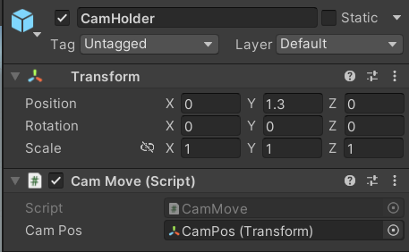
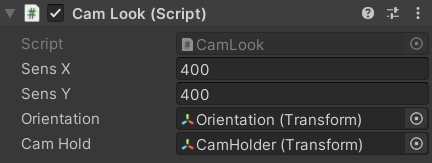

# PlayerMovement

<p>player movement for unity.</p>

that have:

```
- slope movement
- sprinting
- crouching
- slidng
- wallrunning
- climbing
- dash
```

## Hierarchy


## Inpector

### camera holder



### main camera / player camera



required **DOTween (HOTween v2)** for camera

### playermovement

