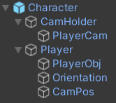

# PlayerMovement

<p>player movement for unity.</p>

that have:
```
- slope movement
- sprinting
- crouching
- slidng
- wallrunning
- climbing
- dash
```

## Hierarchy



## Inpector


required **DOTween (HOTween v2)** for camera
